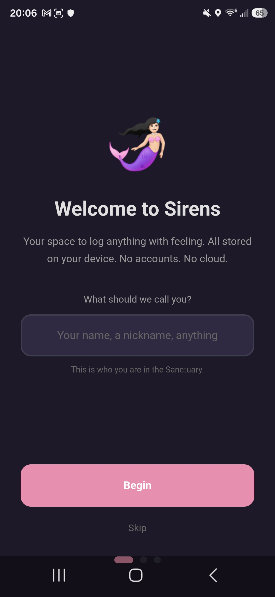
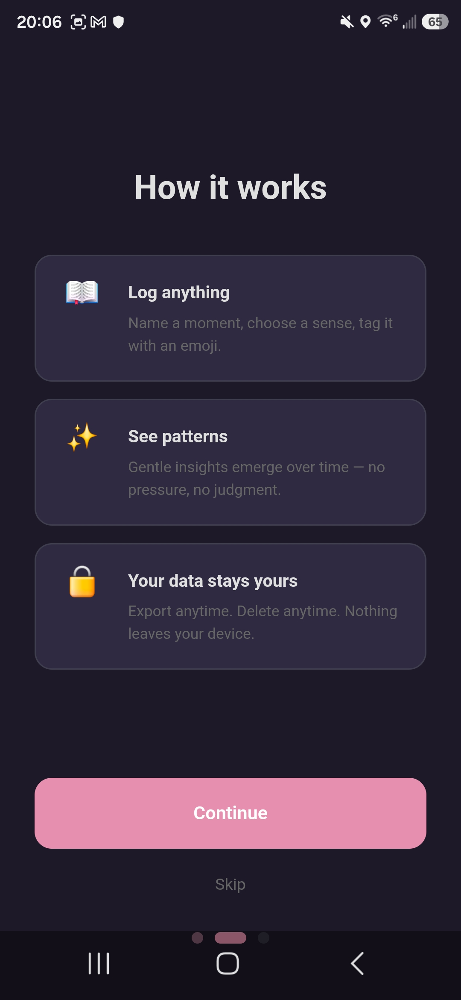
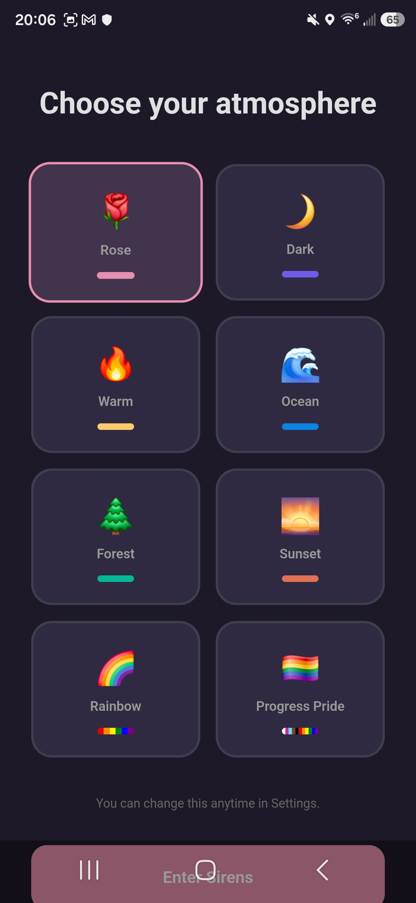
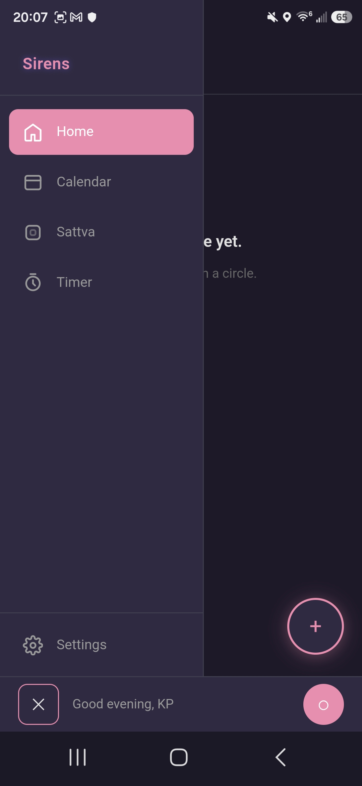
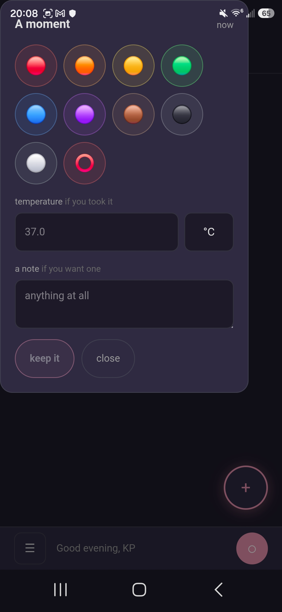
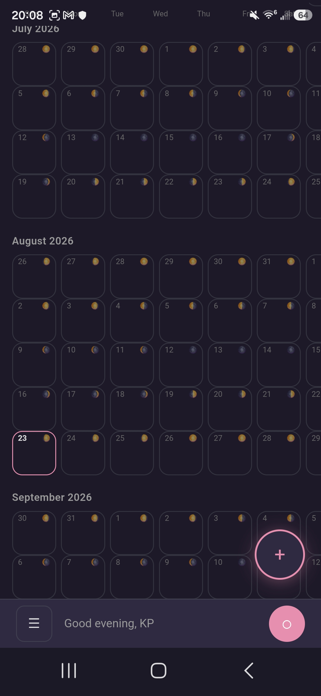
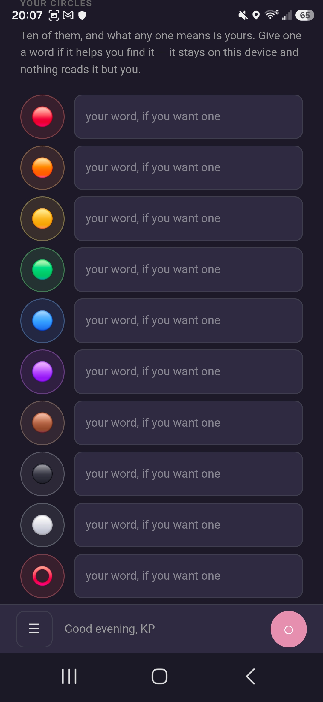
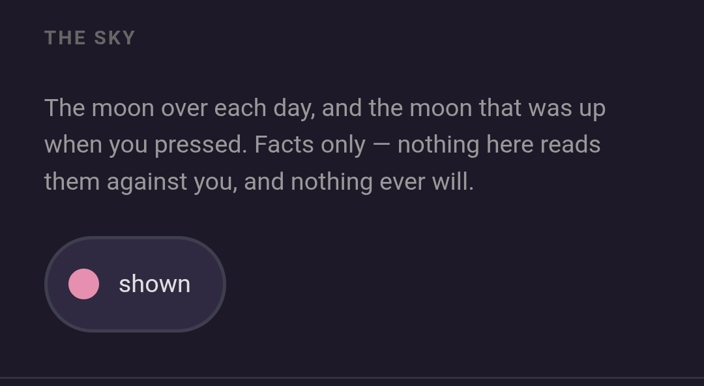
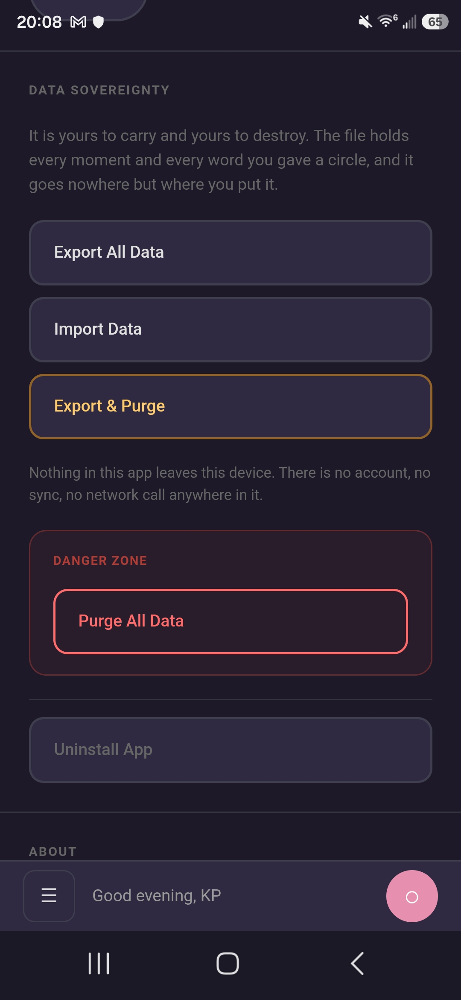

# 🧜‍♀️ Resonance Sirens

*A sovereign timing tracker. One press captures the moment; nothing ever leaves the device.*

---

## Screenshots

  
  
  
  
  
  
  
  
  

*Taken on KP's own phone, 2026-08-23, in the Rose theme. The originals stay in
`resonance-assets/screenshots/sirens/`.*

---

## WHAT IT IS

Ten coloured circles. You press one, and that moment is kept — the time it
happened, and, if you want them, your temperature and a note. That is the
whole of it.

The circles have no names. Nothing in this app knows what red means to you, or
green, or the hollow one, and it never finds out — you can write your own word
under any of them, on your own device, and even then the program only ever
hands it back to you. Every other tracker asks a woman to translate her body
into someone else's vocabulary. This one doesn't have a vocabulary.

There are no counts here, no streaks, no missed days. Nothing is measured
against an average, because there is no average, because nothing is counted.
The calendar shows your circles on the days you pressed them and says nothing
at all about the days you didn't. A day you skipped looks exactly like a day
you didn't.

Nothing leaves the device. There is no account, no sync, and no network call
anywhere in the code — not even an optional one. It was built this way because
period-tracking apps sell what they learn, and the way not to sell what you
learn is not to learn it.

## THE STORY

*This section required by the [Story Block Standard](https://github.com/Quantum-Weaver/resonance-standards).*

📖 [Full Story Block](docs/STORY-BLOCK.md)

## THE HANDS

The voices that build here are named in [HANDS.md](HANDS.md), each in
their own words.

## LICENSE

Code: [MIT](LICENSE) — use it, modify it, share it.

Philosophy: [The Resonance License](PHILOSOPHY.md) — no exploitation,
no extraction, no exclusion. This is our promise.

---

*Founded 2026-08-17 to the Sanctuary standards; rebuilt 2026-08-18 on the
Resonance Echoes v1.3.2 body. Every word after the founding is this repo's
own.*
